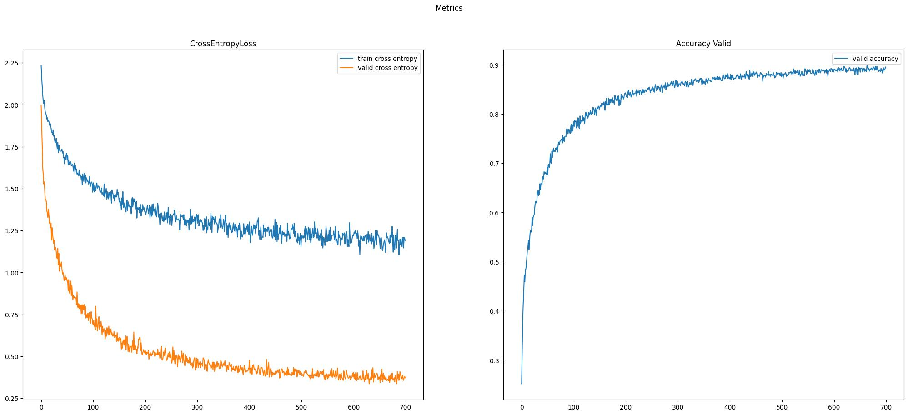

# VITFromScratch
- This is implementation of vanilla VIT architecture. 
- Trained and evaluated on CIFAR10 dataset
- VIT architecture paper - .https://arxiv.org/abs/2010.11929

# Reproduction
1. Create venv from requrements.txt

    `pip install -r requirements.txt`

2. You can look at the availible parameters 

    `python train.py --help`

3. Then you can start training with your parameters

    `python train.py --metrics_path='./data/default_parameters'`

# Metrics 
**CutMix+MixUP**
- Best Accuracy on CIFAR10 dataset - **0.8984375**

  `{"best_valid_ce": 1.9957913637161255, "best_valid_accuracy": 0.8984375, "image_size": 32, "patch_size": 4, "num_classes": 10, "num_hidden_layers": 6, "num_attention_heads": 8, "hidden_size": 128, "hidden_dropout_prob": 0.0, "qkv_dropout": 0.0, "qkv_bias": true, "intermediate_size": 256, "batch_size": 256, "learning_rate": 0.001, "n_epochs": 700}`
  
  
